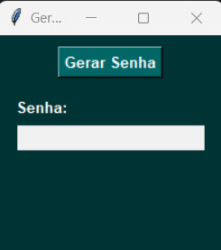

# 🔏 Gerador de Senhas

Este é um aplicativo simples de interface gráfica (GUI) desenvolvido em Python usando Tkinter. Ele gera uma senha baseada na data atual e a exibe na interface do usuário.

## 📌 Funcionalidades
- Gera uma senha baseada na data atual.
- Exibe a senha gerada na interface gráfica.
- Interface amigável com design simples.

## 🛠 Tecnologias Utilizadas
- Python
- Tkinter

## 🚀 Como Executar o Projeto
1. Certifique-se de ter o Python instalado em seu sistema.
2. Baixe ou clone este repositório.
3. Execute o seguinte comando no terminal ou prompt de comando:

```sh
python gerador_senha.py
```

## 🖥 Captura de Tela



## 📄 Licença
Este projeto é totalmente para fins de aprendizagem
